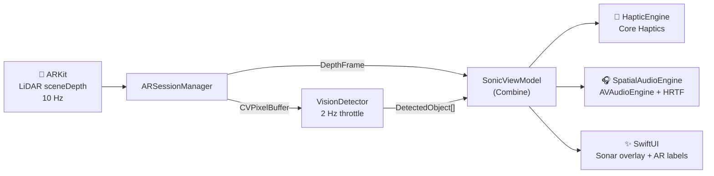

<div align="center">

# 🔊 Sonic Vision

### *Feel the space. Hear the world.*

**Multi-sensory spatial awareness for blind and low-vision users —
turning LiDAR depth into touch and sound, entirely on-device.**


*My submission to Apple's **Swift Student Challenge 2026*** 🍎

**English** · [🇫🇷 Français](README.fr.md)

</div>

---

## 💡 The idea

Close your eyes and try to cross a room. Every step is a question.

An iPad Pro carries a **LiDAR scanner** that measures the exact distance to everything in front of it, sixty times per second. That data usually feeds AR games and room-scanning apps — but what if it could feed **your other senses** instead?

**Sonic Vision** converts real-time depth into two intuitive channels:

- 🤲 **Haptics** — the closer an obstacle, the stronger and sharper the vibration, following an inverse-exponential curve that matches human perception (not a naive linear mapping).
- 🎧 **3D spatial audio** — a sonar-like ping, positioned in real 3D space around your head with HRTF rendering. An obstacle on your left *sounds* like it's on your left.
- 🗣️ **On-device recognition** — the Vision framework identifies people and objects in the scene and surfaces them as floating AR labels, with no ML model file and no cloud.

Point the iPad at the world, and the world answers back — through your hands and your ears. All of it computed on-device, with **zero network calls and zero data collection**.

> ⚠️ Sonic Vision is an experimental, complementary tool — **not** a medical device, and not a replacement for a white cane, a guide dog, or O&M training. See [Disclaimers](#%EF%B8%8F-disclaimers).

---

## 📖 The story behind this project

I wanted my Swift Student Challenge entry to be more than a demo — I wanted it to argue something: **that serious accessibility tools can be tiny, private, and immediate.**

The challenge imposes brutal constraints: a Swift Playgrounds app (`.swiftpm`), **under 25 MB**, judged in about three minutes, working fully **offline**. Most people treat those constraints as limits. I treated them as the design brief:

- **No CoreML model file.** Instead of shipping a multi-megabyte network, I combined the Vision framework's built-in detectors (`VNDetectHumanRectanglesRequest`, `VNDetectRectanglesRequest`, `VNClassifyImageRequest`) with geometric heuristics. Detection costs **0 bytes** of assets.
- **No audio files.** Every sonar ping is a **sine wave synthesized programmatically** — PCM buffers pre-cached at 400 / 800 / 1200 Hz with an anti-click envelope, then spatialized through `AVAudioEnvironmentNode` with HRTF-HQ rendering.
- **No external dependencies.** Pure Apple frameworks, nothing else.

The result: the entire app is **~100 KB of source** — about **0.4%** of the size budget.

There's also an unusual production detail I'm a little proud of: this iPad LiDAR app was engineered **without a Mac**. The target IDE is Swift Playgrounds on iPad, and the codebase was developed and audited from a Windows/WSL2 environment — which forced a discipline of architecture-first thinking, careful API reading, and systematic review instead of trial-and-error compiling.

And that discipline got tested. Before submission I ran a full **pre-submission audit** ([`AUDIT_REPORT.md`](AUDIT_REPORT.md) — kept in this repo on purpose, bugs and all). It found **9 issues**, including three genuinely humbling ones:

1. 🕳️ The AR camera view was silently running its **own separate `ARSession`**, disconnected from the depth pipeline — the app would have demoed a black screen.
2. ⚡ A **race condition** on the camera pixel buffer, written from ARKit's thread and read from the main thread.
3. 📉 A **double multiplication** of haptic intensity that turned the sensitivity slider quadratic instead of linear.

Every critical issue was fixed, the sonar overlay and AR labels were built, and the project grew from 1,441 to ~2,000 lines — leaner in behavior, richer in experience. Shipping the audit alongside the code is the point: engineering isn't pretending bugs never existed; it's finding them before your users (or a jury) do.

---

## ⚙️ How it works



The whole experience is a real-time translation table between distance and sensation:

| Distance | Haptic feedback | Audio ping |
|:---:|---|---|
| 3.0 m | barely perceptible hum | slow, low (~400 Hz) |
| 1.5 m | gentle pulse | steady rhythm (~800 Hz) |
| 0.5 m | strong, sharp | fast, bright (~1200 Hz) |
| 0.2 m | maximum urgency | near-continuous — *danger* |

Each service runs on its own cadence so no channel can starve another:

| Service | Framework | Rate | Role |
|---|---|:---:|---|
| `ARSessionManager` | ARKit | 10 Hz | LiDAR depth capture, ROI sampling, simulation fallback |
| `HapticEngine` | Core Haptics | 20 Hz max | continuous patterns, auto-restart on engine reset |
| `SpatialAudioEngine` | AVFoundation | ~6.6 Hz | HRTF 3D positioning, pre-cached sine buffers |
| `VisionDetector` | Vision | 2 Hz | on-device people/object detection, confidence gating |

---

## ✨ Features

- 🔒 **100% offline, privacy-first** — no network calls, no analytics, no data ever leaves the device
- 🤲 **Progressive haptics** — perceptually-tuned inverse-exponential intensity curve with user scaling
- 🎧 **True 3D audio** — HRTF rendering places pings in space (AirPods recommended)
- 👁️ **On-device detection** — people and objects, zero ML model files
- 🌊 **Animated sonar overlay** — concentric pulse waves, color-coded by proximity (cyan → orange → red)
- 🫧 **Liquid Glass design system** — `.ultraThinMaterial` throughout, SF Rounded type scale, spring physics on every interaction
- 🛟 **Graceful degradation** — simulation mode on iPads without LiDAR, engine auto-recovery, permission flows

---

## 🏛 Architecture

**MVVM + Services**, wired with Combine. Views never touch a service directly — everything flows through the ViewModel.

```
SonicVision.swiftpm/            ~2,000 LOC · 17 Swift files · ~100 KB
├── App        SonicVisionApp
├── Views      MainView · ARCameraView · ControlPanelView · SonarOverlayView
│              ARLabelNode · LiquidGlassCard · AccessibilityBadge
├── ViewModel  SonicViewModel (central state + coordination)
├── Services   ARSessionManager · HapticEngine · SpatialAudioEngine · VisionDetector
├── Models     DepthFrame · DetectedObject · HapticPattern
└── Design     DesignSystem (Typo / Space / Radius / Anim tokens)
```

Engineering choices worth noting:

- **Event-driven pipeline** with independent throttles per service (50 / 100 / 150 / 500 ms) — a slow frame in one channel never blocks the others.
- **Region-of-interest depth sampling** (center ~10% + lateral zones) instead of scanning the full depth buffer.
- **Low-pass smoothed values** to kill LiDAR jitter before it reaches your fingertips.
- **No force unwraps, deterministic cleanup** — every service owns its `deinit`, the haptic engine self-heals via `stoppedHandler` / `resetHandler`.

---

## 🚀 Running the app

**Requirements:** iPad Pro (2020+) with LiDAR · iPadOS 17+ · headphones recommended (AirPods Pro ideal). iPads without LiDAR get a simulated demo mode.

1. Clone the repo (or grab `SonicVision.swiftpm`)
2. Open `SonicVision.swiftpm` in **Swift Playgrounds 4+** on iPad — or in **Xcode 15+** on Mac
3. Build & run, grant camera access, press **Start**, and point the iPad at the room
4. Move toward a wall. Feel it before you touch it. 🤲

**45-second demo path** (the challenge cut): scan a cluttered desk → approach one object and feel the haptics climb → pan across the room and watch three objects get labeled while the audio tracks them in space. Full script in [`Demo/Script_demo.md`](Demo/Script_demo.md).

---

## 📁 Repository layout

| Path | What it is |
|---|---|
| [`SonicVision.swiftpm/`](SonicVision.swiftpm) | The app — complete Swift Playgrounds package |
| [`Document_tech/TECHNICAL_DOSSIER.md`](Document_tech/TECHNICAL_DOSSIER.md) | The build blueprint written *before* coding: architecture, data flow, 8-phase plan, thresholds |
| [`AUDIT_REPORT.md`](AUDIT_REPORT.md) | The unvarnished pre-submission audit — 9 bugs found, criticals fixed |
| [`Demo/Script_demo.md`](Demo/Script_demo.md) | The 45-second demo storyboard |

These process documents are published deliberately: the *how* is as much the portfolio piece as the *what*.

---

## ⚠️ Disclaimers

**Sonic Vision is not a medical device.** It is an experimental, complementary spatial-awareness tool and has not been evaluated by any medical or regulatory authority. It does **not** replace a white cane, a guide dog, orientation & mobility training, or any established assistive technology.

**Privacy:** all processing happens on-device. No camera frames, depth data, or usage data is ever transmitted, stored, or shared.

---

## 👤 About me

I'm **Nathan** ([@SynnIA](https://github.com/SynnIA)), a French developer who likes building complete products under tight constraints — and believes the best proof of engineering skill is what you can do with *less*: less size, less dependency, less data collected.

Sonic Vision is my Swift Student Challenge 2026 entry: four Apple frameworks orchestrated in real time, in ~100 KB, with nothing to hide — not even the audit report.

---

<div align="center">

**MIT License** · Built with Swift, ARKit, and a conviction that accessibility deserves beautiful engineering.

*Swift Student Challenge 2026*

<sub>

Built with care by <b><a href="https://nathanfernandes.fr">Nathan Fernandes</a></b> — Founder of SYNN-IA · Dijon, France

🌐 <a href="https://nathanfernandes.fr">Portfolio</a> · 💼 <a href="https://www.linkedin.com/in/nathan-fernandes-a5793b377/">LinkedIn</a> · 🐙 <a href="https://github.com/SynnIA">GitHub</a>

</sub>
</div>
